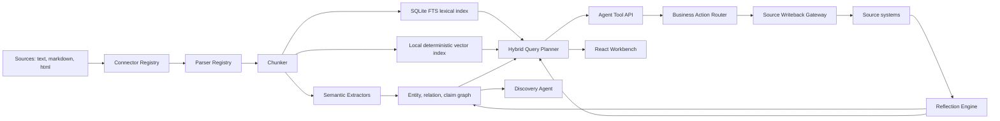

# Semantic Junkyard

Semantic Junkyard is an open-source oriented platform for turning messy, unstructured data into a provenance-rich semantic substrate that AI agents can search, traverse, inspect, and cite.

It is intentionally an orchestration layer, not a new database. The local MVP runs with SQLite/FTS, deterministic embeddings, and an in-process graph so it works immediately. The architecture exposes clean adapter seams for Qdrant, Neo4j, Kuzu, MinIO, Docling, Apache Tika, Unstructured, OpenSearch, PostgreSQL, and external LLM providers.

## Why This Exists

The current ecosystem is powerful but fragmented. GraphRAG-style projects build graph indexes, vector databases solve similarity search, document parsers extract structure, metadata catalogs govern assets, and agent frameworks call tools. Semantic Junkyard combines those concerns into an agent-native context fabric:

- Ingest raw sources with immutable provenance.
- Parse content into source-spanned elements and chunks.
- Build lexical, vector, graph, claim, and entity indexes.
- Let discovery agents profile unknown corpora without predefined guidelines.
- Expose query/navigation tools that agents can use safely.
- Keep every result tied to evidence, confidence, module versions, and permissions.

## Product And PoC Surfaces

Semantic Junkyard now ships as two separate frontend apps over the same product API:

- Product workbench: [http://localhost:5173](http://localhost:5173). This is the actual semantic-layer dashboard for ingestion, discovery, semantic search, graph inspection, semantic curation, business action planning, writeback, and reflected readback.
- PoC cockpit: [http://localhost:5174](http://localhost:5174). This is a separate external client that talks to the product API. It provides a conversational audit chat where a user asks for a business outcome and the PoC app narrates each product tool call as it happens: permission check, discovery, semantic search, entity lookup, graph neighborhood, context expansion, business-action plan, writeback execution, snapshot refresh, and reflected semantic search.

This separation is intentional. The product does not embed PoC state or agent-test controls. The PoC behaves like a real outside application using Semantic Junkyard through REST.

The API exposes agent-friendly tools:

- `GET /api/source-systems`
- `POST /api/ingest/preview`
- `POST /api/ingest`
- `POST /api/semantic/relations`
- `POST /api/business/actions/plan`
- `POST /api/business/actions/execute`
- `GET /api/business/actions/runs`
- `POST /api/tools/semantic_search`
- `POST /api/tools/entity_lookup`
- `POST /api/tools/graph_neighbors`
- `POST /api/tools/find_paths`
- `POST /api/tools/expand_context`
- `GET /api/evidence/:chunkId`

The MCP server exposes the same agent surface over stdio:

- Tools: `explain_permissions`, `semantic_search`, `entity_lookup`, `graph_neighbors`, `find_paths`, `expand_context`, `get_evidence`, `run_discovery`, `business_action_plan`, `business_action_execute`
- Resources: `semantic-junkyard://status`, `semantic-junkyard://manifest`, `semantic-junkyard://catalog`, `semantic-junkyard://graph`, `semantic-junkyard://source-systems`, `semantic-junkyard://evidence/{chunkId}`
- Prompts: `agent_discovery_brief`, `governed_context_answer`, `semantic_mapping_review`

## Controlled Ingestion And Curation

Use ingestion preview when you want to inspect semantics before writing anything:

```bash
curl -X POST http://localhost:8787/api/ingest/preview \
  -H "Content-Type: application/json" \
  -d '{
    "name": "payments-note.md",
    "mimeType": "text/markdown",
    "ingestionMode": "full_data",
    "text": "Payments API depends on Billing Pipeline. Billing Pipeline writes Revenue Mart."
  }'
```

Use semantic curation when a domain owner wants to control what depends on what:

```bash
curl -X POST http://localhost:8787/api/semantic/relations \
  -H "Content-Type: application/json" \
  -d '{
    "sourceName": "Payments API",
    "sourceType": "System",
    "relationType": "DEPENDS_ON",
    "targetName": "Billing Pipeline",
    "targetType": "Process",
    "rationale": "Confirmed by the platform owner."
  }'
```

Curated relations are persisted as evidence-backed graph edges. The UI exposes the same workflow in the Ingest preview and Semantic control panels.

## Business Actions With Source Reflection

Semantic Junkyard now supports business-level actions that write to configured source systems and then reread those sources before updating the semantic read model. The user asks for an outcome, not a connector call:

```text
Align Failed Payment Rate definition across Finance and Billing,
then make it reflected in source systems.
```

Plan first:

```bash
curl -X POST http://localhost:8787/api/business/actions/plan \
  -H "Content-Type: application/json" \
  -d '{
    "intent": "Align Failed Payment Rate definition across Finance and Billing, then make it reflected in source systems.",
    "mode": "autonomous",
    "maxAutonomousRisk": "medium"
  }'
```

Execute through the writeback gateway:

```bash
curl -X POST http://localhost:8787/api/business/actions/execute \
  -H "Content-Type: application/json" \
  -d '{
    "intent": "Align Failed Payment Rate definition across Finance and Billing, then make it reflected in source systems.",
    "mode": "autonomous",
    "maxAutonomousRisk": "medium"
  }'
```

The local product writes source records for Data Catalog, OpenMetadata-style lineage, dbt semantic repository PR proposals, and governance ticketing. It then rereads those records, creates reflection evidence, refreshes search/graph context, and records a business action run. A write is considered complete only when reflection verifies the source state.

## Quick Start

```bash
npm install
npm run dev
```

Open the product at [http://localhost:5173](http://localhost:5173) and the PoC cockpit at [http://localhost:5174](http://localhost:5174). The API runs on [http://localhost:8787](http://localhost:8787).

Useful frontend environment variables are `VITE_API_URL`, `VITE_PRODUCT_URL`, `VITE_POC_URL`, and `VITE_POC_ENTITY_HINTS` for configuring API routing, cross-app links, and PoC graph-grounding hints.

Run only the product surface:

```bash
npm run dev:product
```

Run only the PoC cockpit plus API:

```bash
npm run dev:poc
```

Seed the demo corpus:

```bash
npm run seed
```

Run checks:

```bash
npm run typecheck
npm run test
npm run build
```

Run the local autonomous agent PoC:

```bash
npm run poc:agent
```

The PoC creates an in-memory semantic layer, runs a local agent loop over a governed finance use case, checks its autonomy boundary, searches evidence, resolves entities, traverses a bounded graph neighborhood, expands context, plans a business action, executes policy-governed source writeback, verifies reflection, refreshes semantic evidence, and writes a reproducible report to `artifacts/poc/local-agent-use-case-report.json`.

Run the same PoC with a local Hugging Face MLX model:

```bash
npm run poc:agent:hf
```

The local model runner autodiscovers `~/.cache/huggingface/hub`, prefers `mlx-community/Qwen3-1.7B-4bit` when present, and executes through `uv` with `mlx-lm`. The PoC cockpit exposes the same flow as an external app. It shows audit-safe operational reasoning summaries, tool choices, discoveries, observations, and citations; it does not expose private chain-of-thought.

Run the MCP agent PoC:

```bash
npm run poc:agent:mcp
```

This builds the MCP server, starts it over stdio, connects a real MCP client, lists tools/resources/prompts, calls discovery tools, opens evidence, plans and executes a reflected business action, and writes `artifacts/poc/mcp-agent-use-case-report.json`.

Start the MCP server for an external agent:

```bash
npm run build
npm run mcp
```

Example client configuration:

```json
{
  "mcpServers": {
    "semantic-junkyard": {
      "command": "node",
      "args": ["/absolute/path/to/semantic-junkyard/apps/mcp/dist/server.js"]
    }
  }
}
```

Use `SEMANTIC_JUNKYARD_DB=/path/to/semantic-junkyard.sqlite` or `--db /path/to/semantic-junkyard.sqlite` to point the MCP server at a specific local database. Without either option, the server uses the product database at `apps/api/data/semantic-junkyard.sqlite`.

## Default Local Architecture



## Adapter Strategy

The MVP is embedded by default and pluggable by design:

| Capability | Local default | Production adapters |
| --- | --- | --- |
| Metadata and jobs | SQLite | PostgreSQL |
| Lexical search | SQLite FTS5 | OpenSearch, PostgreSQL full text |
| Vector search | Local hashed embeddings | Qdrant, pgvector, Milvus, Weaviate, LanceDB |
| Graph traversal | SQLite graph tables | Neo4j, Kuzu, Memgraph, Apache AGE |
| Raw objects | Local text rows | Filesystem, S3, MinIO |
| Parsing | Text/Markdown/HTML parsers | Docling, Apache Tika, Unstructured |
| LLM extraction | Deterministic extractor, local Hugging Face MLX PoC | OpenAI-compatible, local Ollama, Anthropic-compatible adapters |
| Agent access | REST tool endpoints | MCP server, GraphQL, SDKs |
| Business action routing | Semantic action planner | LangGraph, Temporal, workflow engines |
| Source writeback | Local source records | OpenMetadata, DataHub, GitHub PRs, Jira, ServiceNow, DB comments |
| Reflection | Immediate source-record readback | CDC, webhooks, catalog harvesters, OpenLineage events |

## Repository Layout

```text
apps/api           Express API, semantic engine, storage adapters
apps/mcp           MCP stdio server and MCP agent PoC
apps/web           React workbench
packages/shared    Shared contracts and types
docs               Architecture, module specs, market scan, roadmap
examples/data      Demo corpus
assets/design      Generated UI concept and verification screenshots
```

## Design Principles

- No hardcoded ontology: schemas and merge rules are configuration-owned.
- Provenance first: every chunk, entity, relation, and claim points back to evidence.
- Datastore agnostic: use small interfaces and documented adapter contracts.
- Agent-native: expose structures agents can traverse, not only chat answers.
- Incremental discovery: unknown data should be profiled before extraction becomes strict.
- Evaluatable: retrieval quality, citation accuracy, graph usefulness, drift, and cost are first-class.

## Related Ecosystem

This project is inspired by and designed to interoperate with the existing ecosystem:

- [Microsoft GraphRAG](https://microsoft.github.io/graphrag/) for graph-based RAG patterns.
- [Qdrant hybrid search](https://qdrant.tech/documentation/search/hybrid-queries/) for dense/sparse retrieval strategies.
- [Kuzu](https://kuzudb.github.io/) for embedded graph workloads.
- [Docling](https://docling-project.github.io/docling/) for structured document parsing.
- [OpenMetadata](https://github.com/open-metadata/OpenMetadata), [DataHub](https://datahub.com/), and similar metadata platforms for governance lessons.

Semantic Junkyard's wedge is not to replace those systems. It provides the modular semantic control plane that lets an agent safely move across them.
