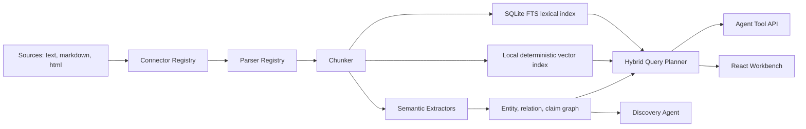

# Semantic Junkyard

Semantic Junkyard is an open-source oriented platform for turning messy, unstructured data into a provenance-rich semantic substrate that AI agents can search, traverse, inspect, and cite.

It is intentionally an orchestration layer, not a new database. The local MVP runs with SQLite/FTS, deterministic embeddings, and an in-process graph so it works immediately. The architecture exposes clean adapter seams for Qdrant, Neo4j, Kuzu, MinIO, Docling, Apache Tika, Unstructured, OpenSearch, PostgreSQL, and external LLM providers.

## Why This Exists

The current ecosystem is powerful but fragmented. GraphRAG-style projects build graph indexes, vector databases solve similarity search, document parsers extract structure, metadata catalogs govern assets, and agent frameworks call tools. Semantic Junkyard combines those concerns into an agent-native context fabric:

- Ingest raw sources with immutable provenance.
- Parse content into source-spanned elements and chunks.
- Build lexical, vector, graph, claim, and entity indexes.
- Let discovery agents profile unknown corpora without predefined guidelines.
- Expose query/navigation tools that agents can use safely.
- Keep every result tied to evidence, confidence, module versions, and permissions.

## Product Surface

The web app is a working dashboard, not a marketing page. You can paste text, ingest it, run discovery, search semantically, inspect entities, open evidence, see the generated graph, and inspect an agent trace with selected tools, observations, citations, and a model-produced operational reasoning summary.

The API exposes agent-friendly tools:

- `POST /api/tools/semantic_search`
- `POST /api/tools/entity_lookup`
- `POST /api/tools/graph_neighbors`
- `POST /api/tools/find_paths`
- `POST /api/tools/expand_context`
- `GET /api/evidence/:chunkId`

## Quick Start

```bash
npm install
npm run dev
```

Open [http://localhost:5173](http://localhost:5173). The API runs on [http://localhost:8787](http://localhost:8787).

Seed the demo corpus:

```bash
npm run seed
```

Run checks:

```bash
npm run typecheck
npm run test
npm run build
```

Run the local autonomous agent PoC:

```bash
npm run poc:agent
```

The PoC creates an in-memory semantic layer, runs a local agent loop over a governed finance use case, checks its autonomy boundary, searches evidence, resolves entities, traverses a bounded graph neighborhood, expands context, and writes a reproducible report to `artifacts/poc/local-agent-use-case-report.json`.

Run the same PoC with a local Hugging Face MLX model:

```bash
npm run poc:agent:hf
```

The local model runner autodiscovers `~/.cache/huggingface/hub`, prefers `mlx-community/Qwen3-1.7B-4bit` when present, and executes through `uv` with `mlx-lm`. The UI exposes the same flow in the Agent trace panel. It shows audit-safe operational reasoning summaries, tool choices, discoveries, observations, and citations; it does not expose private chain-of-thought.

## Default Local Architecture



## Adapter Strategy

The MVP is embedded by default and pluggable by design:

| Capability | Local default | Production adapters |
| --- | --- | --- |
| Metadata and jobs | SQLite | PostgreSQL |
| Lexical search | SQLite FTS5 | OpenSearch, PostgreSQL full text |
| Vector search | Local hashed embeddings | Qdrant, pgvector, Milvus, Weaviate, LanceDB |
| Graph traversal | SQLite graph tables | Neo4j, Kuzu, Memgraph, Apache AGE |
| Raw objects | Local text rows | Filesystem, S3, MinIO |
| Parsing | Text/Markdown/HTML parsers | Docling, Apache Tika, Unstructured |
| LLM extraction | Deterministic extractor, local Hugging Face MLX PoC | OpenAI-compatible, local Ollama, Anthropic-compatible adapters |
| Agent access | REST tool endpoints | MCP server, GraphQL, SDKs |

## Repository Layout

```text
apps/api           Express API, semantic engine, storage adapters
apps/web           React workbench
packages/shared    Shared contracts and types
docs               Architecture, module specs, market scan, roadmap
examples/data      Demo corpus
assets/design      Generated UI concept and verification screenshots
```

## Design Principles

- No hardcoded ontology: schemas and merge rules are configuration-owned.
- Provenance first: every chunk, entity, relation, and claim points back to evidence.
- Datastore agnostic: use small interfaces and documented adapter contracts.
- Agent-native: expose structures agents can traverse, not only chat answers.
- Incremental discovery: unknown data should be profiled before extraction becomes strict.
- Evaluatable: retrieval quality, citation accuracy, graph usefulness, drift, and cost are first-class.

## Related Ecosystem

This project is inspired by and designed to interoperate with the existing ecosystem:

- [Microsoft GraphRAG](https://microsoft.github.io/graphrag/) for graph-based RAG patterns.
- [Qdrant hybrid search](https://qdrant.tech/documentation/search/hybrid-queries/) for dense/sparse retrieval strategies.
- [Kuzu](https://kuzudb.github.io/) for embedded graph workloads.
- [Docling](https://docling-project.github.io/docling/) for structured document parsing.
- [OpenMetadata](https://github.com/open-metadata/OpenMetadata), [DataHub](https://datahub.com/), and similar metadata platforms for governance lessons.

Semantic Junkyard's wedge is not to replace those systems. It provides the modular semantic control plane that lets an agent safely move across them.
