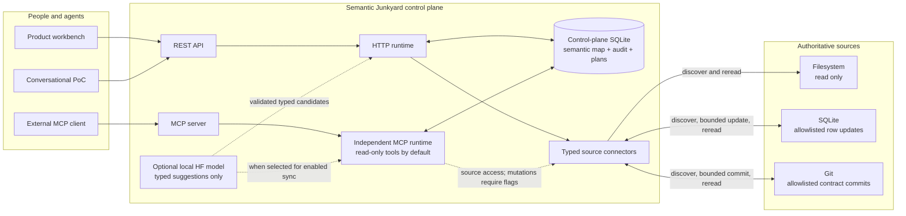

# Semantic Junkyard

## What this changes in the real world

Important business knowledge is often scattered across documents, databases, and repositories. An
AI agent may find a plausible answer but lose where it came from, or update the wrong record without
checking the result. **Semantic Junkyard builds one searchable map across those sources while
keeping the originals in charge, then makes every supported change pass through a reviewable plan
and an authoritative readback.**

### A concrete example

An operations user asks an agent to mark order `ORD-1001` as dispatched. The system identifies the
exact configured database row, records its current version, checks policy, performs the allowlisted
update, and reads the row again. Only when the source itself says `dispatched` does the semantic map
publish fresh evidence. If the row changed in the meantime, execution stops instead of overwriting
someone else's work.

Semantic Junkyard is for data, platform, and operations teams that want agents to work across
existing knowledge sources without turning a model or a new catalog into the source of truth.

| Feature | Practical benefit |
| --- | --- |
| Federated map across files, SQLite, and Git | People and agents can discover related knowledge without moving ownership away from existing systems. |
| Source-linked evidence and provenance | An answer can show where a fact came from and which version was observed. |
| Reviewable semantic proposals | Model suggestions remain suggestions until deterministic checks or a person accepts them. |
| Exact change plans with policy and optional approval | A reviewer can see the target, expected change, and authorization context before a write. |
| Authoritative post-write readback | Success means the requested state was observed at the real source, not merely that a connector returned `200 OK`. |
| Read-only MCP defaults | An external agent starts with bounded discovery rather than silent write authority. |

> **Maturity:** This is a local-first reference product, not a production multi-tenant platform.
> It currently implements local filesystem, SQLite, and Git connectors with a single-node SQLite
> control plane. Production IAM, tenant isolation, source-ACL propagation, high availability, and
> managed cloud connectors remain outside the current implementation.

## Technical scope

Semantic Junkyard is a local-first reference implementation of an **agent-safe semantic federation and verified semantic-action protocol**.

It is not another data catalog and it does not become the authority for connected data. It observes configured sources, preserves evidence and source identity, separates authoritative facts from reviewable semantic proposals, exposes bounded context to agents, and permits a change only through an exact capability contract:

```text
business intent
  -> typed source target and exact diff
  -> source-version preconditions
  -> policy and optional human approval
  -> idempotent write
  -> authoritative source reread
  -> postcondition
  -> semantic refresh only after verification
```

The repository proves this contract against real local filesystem, SQLite, and Git sources. It is deliberately not presented as a production-ready multi-tenant platform.

## Understand It In One Minute

Semantic Junkyard builds a **derived map of existing data** for people and AI agents. The original files, databases, and repositories remain the systems of record.



Three rules explain the system:

1. **The semantic layer is a map, not the source of truth.** Every useful statement keeps its source and evidence identity.
2. **Models may suggest; deterministic controls decide.** Model output can become a reviewable proposal or a typed intent, never an approval or an unrestricted write.
3. **A plan belongs to one authorization context.** Actor, roles, clearance, and policy version are persisted in the plan identity; another principal must create a new plan.
4. **A write is complete only after authoritative readback.** A connector success response is insufficient; the expected postcondition must be observed from the source and reflected into fresh semantic evidence.

Start with [How Semantic Junkyard works](docs/how-it-works.md), then use the [Hands-on guide](docs/user-guide.md) to run the real read-only, autonomous SQLite, and approval-gated Git workflows. The [documentation index](docs/README.md) provides paths for operators, agent builders, connector authors, and reviewers.

## What The Product Is

Semantic Junkyard combines two responsibilities that are usually split across several systems:

1. **Semantic federation for agents.** Discover physical and semantic resources across configured sources, materialize provenance-linked evidence, expose lexical/vector/graph retrieval, and retain source authority.
2. **Verified change control.** Resolve a business request to one configured write capability, bind its exact target and preconditions into a fingerprint, enforce policy and approval, execute idempotently, reread the authoritative source, and publish reflection evidence only when the postcondition passes.

The control plane stores observations, proposals, evidence, decisions, plans, approvals, runs, and audit events. The filesystem, operational SQLite database, and Git repository remain the authoritative sources.

The defensible product wedge is the second responsibility: a reusable, connector-conformance protocol for proving that an agent-requested business change reached the correct authoritative source and came back as governed read evidence. Search, catalogs, graphs, and MCP access are integration surfaces, not differentiation claims. The [market scan](docs/market-scan.md) explains why production deployments should integrate established context platforms instead of rebuilding them.

Source-local catalog identifiers are namespaced by connection before entering the federated read model. The original identifier remains provenance metadata, so equal IDs from different domains cannot overwrite one another and deleting a connection removes only its owned assets, metrics, policies, lineage, contracts, and ontology classes.

See [Product definition](docs/product-definition.md) for scope and non-goals and [Reference workflow](docs/reference-workflow.md) for an end-to-end acceptance path.

## Local Reference Product

A persistent development start creates a supply-chain reference environment when no source connections exist:

| Source | Discovery | Governed write behavior |
| --- | --- | --- |
| `Supply Chain Knowledge` | Real local files: Markdown policy, CSV reference data, OpenLineage JSON, and supported documents. | Read-only. The filesystem connector has no write method. |
| `Operations Database` | Real SQLite schema, columns, primary/foreign keys, row counts, optional samples, sensitivity signals, and evidence. | One allowlisted `orders.status` update selected by key. A source-row hash is the optimistic precondition; readback uses a new read-only connection and exact field equality. |
| `Semantic Contract Repository` | Real committed Git tree and YAML semantic contracts with commit/blob provenance. | Only configured semantic-contract paths. Approval is required; HEAD and blob hashes are preconditions; the connector commits only the planned path and verifies committed content and fields with `git show`. |

The filesystem connector supports `txt`, `md`, `html`, `json`, `jsonl`, `csv`, `yaml`, `yml`, and `pdf`, with file-count/size bounds and symlink rejection. `metadata_only` and `external_reference` ingestion retain no submitted payload text in the control-plane source record; they index a registration note instead.

There is no generic SQL executor, shell tool, arbitrary file writer, or write path for an unknown source. A write is possible only when a compiled connector resolves exactly one target that is exposed by explicit configuration.

## Semantic Proposal Lifecycle

Source synchronization distinguishes observation from interpretation:

- **Authoritative source facts** such as SQLite columns, foreign keys, and declared contract-to-metric relations are accepted automatically, tagged `source_fact`, and cannot be rejected in the semantic layer. They must be changed at the source or in its authority mapping.
- **Connector deterministic inferences** and **local-model candidates** are stored as `proposed` assertions with confidence, explanation, origin, resource IDs, and evidence chunk IDs.
- Operators accept or reject non-authoritative proposals with a rationale in the product UI or REST API.
- A later source sync marks assertions that are no longer emitted as `superseded` and removes them from active navigation.

Acceptance never makes an inference authoritative. Pending connector proposals are visible to operators with an explicit lifecycle, but agent graph tools and graph retrieval exclude them until acceptance. Rejected and superseded relations are inactive. Direct-ingest relations are marked `proposed` and excluded from agent graph reasoning, but they do not yet have first-class proposal records; manual curation requires a rationale and creates an accepted, non-authoritative relation. See [How semantic meaning is governed](docs/how-it-works.md#5-how-semantic-meaning-is-governed).

The optional Hugging Face path can suggest concepts, classifications, relations, and conflicts from a bounded list of observed resources. Strict schemas discard malformed output, invented resource IDs, self-relations, duplicates, and over-limit candidates. A model proposal never becomes an authoritative source fact.

## Product And Agent Surfaces

| Surface | Default | Responsibility |
| --- | --- | --- |
| Product workbench (`apps/web`) | `http://localhost:5173` | Operator-facing source registry, connection test/sync, proposal review, retrieval/graph inspection, exact plan review, approval, execution, readback, and audit. |
| External conversational PoC (`apps/poc`) | `http://localhost:5174` | Independent REST client that starts deterministic and read-only, returns an answer/claim/citation contract, and exposes opt-in plan-only and autonomous workflows. It stops for missing evidence, no writable source, policy blocks, or required approval. |
| API (`apps/api`) | `http://127.0.0.1:8787` | HTTP control plane and generated reference OpenAPI document. |
| MCP server (`apps/mcp`) | stdio | External agent surface over the same engine contracts. It opens the selected control-plane SQLite database directly and intentionally cannot create approvals or decide proposals. |

The two React applications do not share frontend state. The browser PoC is not an MCP client; it calls the product API through its own client module. `npm run poc:agent:mcp` is the separate real MCP client/server proof of concept.

## Deterministic And Local-HF Enrichment

The default semantic path is deterministic and offline:

- local parsing and stable chunking;
- extractive summaries and pattern-based entities/relations/claims;
- 128-dimensional signed hash embeddings;
- SQLite FTS5 plus deterministic vector and graph score fusion;
- deterministic source profiling, policy checks, target resolution, and postcondition evaluation.

Local Hugging Face generation through MLX is optional and has three bounded roles: source-enrichment proposals, conversational intent interpretation, and a bundled trace summary. It does not approve actions, bypass connector rules, choose arbitrary targets, or decide whether a postcondition passed. Prompts explicitly request typed output without chain-of-thought; the product records evidence, tool observations, concise explanations, and decisions, not hidden reasoning traces.

`ollama` and `openai-compatible` values currently affect provider configuration reporting only. They are not injected into discovery, extraction, embeddings, planning, or policy. See [Local models](docs/local-models.md).

## Quick Start

Prerequisites: Node.js 20.19 or later, npm, SQLite support supplied by the lockfile, and Git for the reference contract repository.

```bash
npm ci
npm run dev
```

`npm run dev` builds the shared contracts and starts the API, product workbench, and conversational PoC. The persistent API start reconciles the three deterministic reference connections and retries connections that are `configured`, `syncing`, `error`, missing a last sync, or missing published resources. Set `SEMANTIC_JUNKYARD_BOOTSTRAP_REFERENCE_SOURCES=false` to disable that bootstrap.

Focused commands:

```bash
npm run dev:product       # API + operator workbench
npm run dev:poc           # API + external REST PoC
npm run build
npm run mcp               # built MCP stdio server
npm run poc:agent:mcp     # real MCP client/server reference run
```

The API reads environment variables from its process. It does not automatically load the root `.env` file. The complete template is [.env.example](.env.example).

From the product dashboard, **Run mission** synchronizes every selected/configured source and profiles the resulting fabric as one durable report. The equivalent operator API is `POST /api/discovery/missions`; MCP exposes `discover_sources` only when started with `--allow-sync`.

## Reference Actions

The seeded SQLite action is autonomous and low-risk:

```text
Set order ORD-1001 status to dispatched
```

The seeded Git action resolves to a configured YAML contract and requires approval:

```text
Use dispatch eligible orders as the denominator for Late Dispatch Rate and publish version 2
```

For both paths, planning is read-only. Execution recomputes the plan against current source state; a changed target, row hash, Git HEAD, blob, diff, risk decision, or warning changes the fingerprint or fails a connector precondition. Only an exact reread that satisfies the connector postcondition can produce `verified` reflection evidence.

If the SQLite row already has the requested allowlisted value, the plan is marked as a no-op and execution performs only the precondition and authoritative reread; it does not issue a redundant `UPDATE`.

## Principal HTTP Contracts

The generated OpenAPI document is at `GET /api/openapi.json`. Liveness is exposed at `GET /api/health`; `GET /api/ready` returns `503` while reference bootstrap is initializing or degraded. Principal route groups are:

- Source federation: `GET/POST /api/source-connections`, connection `test` and `sync`, `GET /api/source-resources`, and `GET /api/source-sync-runs`.
- Proposal governance: `GET /api/semantic/proposals` and `POST /api/semantic/proposals/:proposalId/decision`.
- Retrieval: scoped `semantic_search`/`expand_context` (`domain` by default, `operational` for receipts), `source_resource_search`, `entity_lookup`, `graph_neighbors`, `find_paths`, and direct evidence reads.
- Change control: `POST /api/business/actions/plan`, `/approve`, and `/execute`; run and approval listings are separate.
- Agent integration: intent interpretation, manifest, MCP descriptors, discovery runs, audit events, and the bundled local PoC route.

Request bodies are strict Zod contracts. Unknown keys, including a caller-supplied `approved` flag, are rejected.
HTML ingestion also fails closed when configurable input-length, tree-depth, or child-node limits are exceeded; the safe defaults are documented in `.env.example`.

Every business-action plan is persisted before it can be approved or executed. Its identity includes the authenticated actor, normalized roles, clearance, and policy version. Execution by a different principal returns `PLAN_PRINCIPAL_MISMATCH`; a missing or stale plan cannot be reconstructed from caller input alone.

## MCP Contract

Build before starting the stdio server:

```bash
npm run build
npm run mcp
```

Example client configuration:

```json
{
  "mcpServers": {
    "semantic-junkyard": {
      "command": "node",
      "args": ["/absolute/path/to/semantic-junkyard/apps/mcp/dist/server.js"]
    }
  }
}
```

The MCP server is read-only by default. It exposes bounded tools for permission explanation, resource/semantic search, entity and graph navigation, context/evidence retrieval, proposal listing, and action planning. Persisted discovery, configured-source synchronization, and business execution are registered only with `--allow-discovery`, `--allow-sync`, and `--allow-write` respectively. It exposes no tool for connection creation, proposal decisions, or approval creation. An `approvalId` may be consumed only if a human-facing API channel created it for the exact plan.

Use `--db <path>` or `SEMANTIC_JUNKYARD_DB=<path>` to select the control-plane database, `--memory` for an in-memory seeded runtime, and `--no-seed` to disable that memory seed. Grant mutation flags independently and only to a trusted client. The bundled MCP PoC explicitly starts its private server with `--allow-write`. MCP does not inherit REST authentication or CORS. The spawned process has its operating-system filesystem authority, including access to local source paths stored in the selected database.

See [Agent contract](docs/agent-contract.md).

## Trust Boundaries

- Connected content is untrusted data. It cannot redefine tool policy or connector configuration.
- The local source is authoritative for source facts and postconditions; the control-plane read model is derived.
- Capability templates describe possible integrations but are not executable. Without a managed connector, a target is blocked and cannot claim source verification.
- Non-authoritative semantic assertions require review and remain distinguishable by lifecycle and origin.
- The browser API boundary and the MCP process boundary are different. REST tokens do not constrain a local MCP process.
- The default tokenless loopback profile grants a development-only local owner role. Authenticated mode requires distinct agent, operator, and approver bearer tokens, but these static tokens are not production IAM.
- Local idempotency is enforced in the control-plane SQLite database. It is not a distributed transaction or durable exactly-once guarantee across crashes.

## Current Limitations

- Single-node SQLite is the only control-plane store. There is no production clustering, tenancy, migration service, backup orchestration, or high-availability design.
- Only local filesystem, SQLite, and Git connectors are implemented. There are no production DataHub, OpenMetadata, cloud object-store, warehouse, ticketing, or remote Git-provider connectors.
- There is no production IAM, tenant isolation, source-ACL propagation, approval delegation/expiry/revocation workflow, or secrets manager.
- Synchronization and actions run in process. Per-connection SQLite leases prevent overlapping syncs across runtime instances, and deterministic observation replacement is transactional, but there is no durable job queue, scheduler, retry service, outbox, or crash-recovery reconciler.
- Control-plane transactions and source-native writes are not one distributed transaction. In-process ambiguous outcomes are persisted as `reconciliation_required` and cannot reuse a consumed approval. A process crash after a source commit but before control-plane persistence can still leave no run record; there is no reconciliation worker.
- Arbitrary unknown-source writes are intentionally unsupported. SQLite updates require an allowlisted table, key, and columns; Git writes require an allowlisted semantic-contract path; filesystem is read-only.
- Deterministic extraction, entity resolution, intent parsing, and hash embeddings are reference-quality implementations, not production semantic quality.
- Local-HF execution is Apple Silicon/MLX-oriented, depends on a pre-cached compatible model and runtime packages, and has no model-faithfulness release gate.
- The product does not request or persist hidden chain-of-thought. Auditability is based on observable evidence, typed artifacts, policy decisions, tool events, diffs, and source readback.
- Static catalog/metadata/ticketing capability templates remain as configuration examples. They are blocked until a managed adapter exists and must not be described as external integrations.

See [Architecture](docs/architecture.md) for the full boundary analysis.

## Verification

```bash
npm run typecheck
npm test
npm run build
npm run test:e2e
```

`npm run check` runs type checking, Vitest, and the production build; Playwright remains a separate command. See [Evaluation](docs/evaluation.md) and the acceptance checklist in [Reference workflow](docs/reference-workflow.md).

## Repository Layout

```text
apps/api           HTTP control plane, semantic runtime, source connectors, local model harness
apps/mcp           MCP stdio server and external MCP PoC client
apps/poc           independent conversational REST client
apps/web           operator product workbench
packages/shared    strict shared Zod contracts
docs               product, architecture, contracts, workflow, evaluation, and market context
```

## Documentation

- [Documentation index](docs/README.md)
- [How Semantic Junkyard works](docs/how-it-works.md)
- [Hands-on guide](docs/user-guide.md)
- [Product definition](docs/product-definition.md)
- [Reference workflow](docs/reference-workflow.md)
- [Architecture](docs/architecture.md)
- [Agent contract](docs/agent-contract.md)
- [Adapter contracts](docs/adapter-contracts.md)
- [Local models](docs/local-models.md)
- [Evaluation](docs/evaluation.md)
- [Market scan](docs/market-scan.md)
- [Contributing](CONTRIBUTING.md)
- [Security](SECURITY.md)
