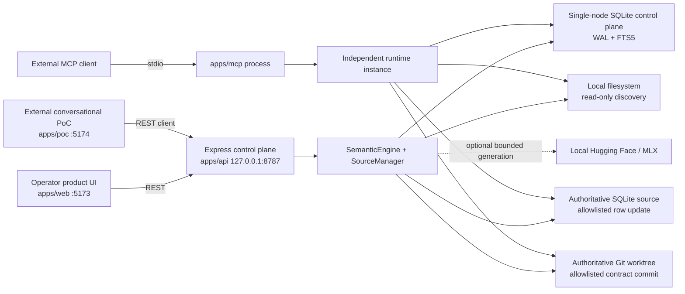
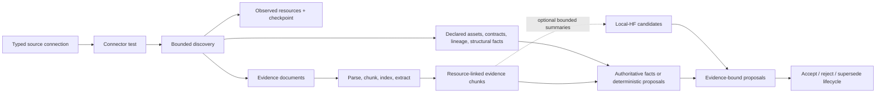
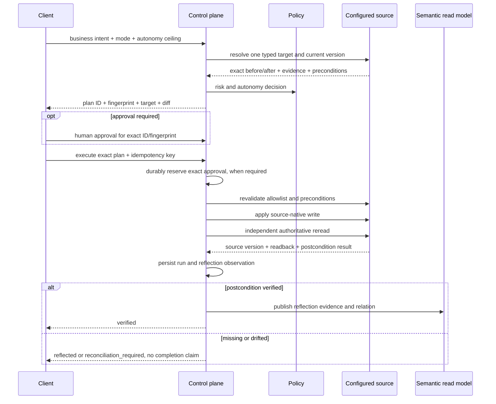

# Architecture

## System Shape

Semantic Junkyard is one local control plane with two browser clients and one MCP process. The product federates source observations into a derived semantic read model; it does not move source authority into that model.

Important process boundaries:

- The product and PoC are independent React builds and independent REST clients.
- The PoC is an external consumer of product contracts, not an embedded privileged agent.
- The MCP server does not proxy the Express API. It constructs the runtime directly, opens the selected SQLite file, and registers mutation tools only when their startup flags are present.
- REST authentication and CORS do not apply to MCP. The MCP process inherits operating-system access to every configured local source path.
- The optional model process receives bounded prompts through stdin. It is not injected as the policy engine or write executor.

## Control Plane Versus Sources

The control-plane SQLite database stores:

- source connection configuration, observed resources, sync runs, and events;
- source artifacts, parsed elements, chunks, FTS rows, hash vectors, entities, relations, and claims;
- semantic assets, metrics, lineage, contracts, policies, and ontology classes;
- semantic proposals and decisions;
- action plans embedded in runs, approvals, write observations, reflection results, and semantic updates;
- audit events.

Connected sources retain their own authority:

- Filesystem content is reread from the configured root during sync.
- SQLite schema and rows are read from a separate database file.
- Git discovery reads committed blobs at `HEAD`; Git postconditions read committed content.

The control plane records a connector readback and a versioned reflection record, but that record is not a substitute for the source-native reread.

## Discovery Pipeline

Every sync persists an event sequence covering connection, inspection, profiling warnings, evidence materialization, extraction/proposal work, supersession, and completion. Sync is in-process; there is no durable worker or resume token.

### Filesystem

- Requires a real directory and rejects a symlink root.
- Skips symlink entries and enforces `maxFiles` and `maxFileBytes`.
- Extracts supported text and PDF content; profiles JSON/JSONL/CSV; parses declared YAML semantic contracts; recognizes OpenLineage event shapes.
- Supports `full_data`, `metadata_only`, and `external_reference` ingestion. The latter two retain no submitted payload text in `sources`.
- Has no write capability.

### SQLite

- Requires a real filesystem database path; memory and URI sources are rejected.
- Test and discovery open the source read-only with `query_only` and inspect `sqlite_master`, `PRAGMA table_info`, and `PRAGMA foreign_key_list`.
- Publishes table/column resources, primary and foreign-key facts, lineage, row counts, optional bounded samples, and inferred sensitivity.
- Exposes writes only when `writeMode` permits them and exactly one valid rule names the table, key column, and allowed columns.

### Git

- Requires a non-bare local worktree with a valid `HEAD`.
- Discovers supported tracked text blobs from the committed tree, not arbitrary untracked content.
- Carries commit SHA, blob SHA, path, and version provenance.
- Parses declared YAML semantic contracts and exposes writes only for configured `semanticContractPaths`.

## Semantic Authority And Proposals

Resources become canonical entities with source connection/resource metadata. Relations have both graph metadata and a proposal record.

- A connector-declared authoritative relation is created as accepted with origin `source_fact`, evidence IDs, and `decidedBy: source`.
- A non-authoritative deterministic relation is created as `proposed`.
- Local-HF output is validated against the exact bounded resource ID set and saved as `proposed` with origin `local_model`.
- A local-model runtime failure marks the synchronization `partial`; deterministic source facts remain available and the failure is recorded without leaking local paths.
- Operators can accept or reject only non-authoritative proposals.
- When a new sync no longer emits an assertion, the previous proposal is marked `superseded`; relation lifecycle metadata is updated so stale assertions leave active navigation.
- When evidence, confidence, or explanation changes for a non-authoritative assertion, the runtime creates a new proposal identity. A prior acceptance or rejection never silently applies to changed evidence.

This keeps three concepts separate: an observed source fact, a reviewable interpretation, and a graph edge available to agents.

Catalog IDs declared by a source are source-local. Before publication, assets, metrics, policies, lineage, contracts, and ontology classes receive connection-scoped stable IDs while retaining their declared ID as provenance. Contract membership is explicit, and resync/delete removes observations by connection ownership rather than by a globally assumed source ID.

## Retrieval Pipeline

The reference semantic runtime is deterministic:

- stable SHA-256-derived identifiers where repeatability is required;
- local parsing and semantic-window chunking;
- extractive summaries and pattern/proper-noun extraction;
- 128-dimensional signed token-hash embeddings;
- SQLite FTS5 lexical retrieval;
- deterministic fusion of lexical, vector, graph, quality, freshness, and policy signals;
- bounded graph neighborhoods and path finding.

Policy is applied to catalog, source, search, evidence, graph, and operational responses. It is a local reference policy, not federated source authorization.

## Verified Change Pipeline

### Plan Identity

The plan fingerprint covers the stable plan ID, intent, action type, mode, requested autonomy ceiling, resolved risk, complete target including connector parameters/preconditions, and warnings. `createdAt` is excluded. Approval and execution rebuild the plan from current source state and reject a different ID or fingerprint with `PLAN_CHANGED`.

The request `context` is not independently trusted or fingerprinted as an opaque object. Connectors may use typed values from it to disambiguate a target; any effect on execution must appear in the resolved target and therefore in the fingerprint.

### SQLite Write

The SQLite connector accepts only update-like intents, rejects destructive/DDL verbs, resolves one row, excludes the key column from updates, and validates every field against the configured rule again at execution. It then:

1. opens a writable source connection;
2. starts an immediate source transaction;
3. rereads exactly one row and compares its canonical row hash with the plan;
4. executes one parameterized `UPDATE` over allowlisted identifiers and values;
5. requires exactly one changed row, or zero only for a fingerprinted already-satisfied no-op;
6. closes the write connection;
7. opens an independent read-only connection and requires exact equality for every changed field.

Plans and readbacks expose only the key and allowlisted changed columns; the full row is used only inside the connector to compute the optimistic hash. Confidential/restricted profile samples are redacted before publication. When the requested value is already present, execution verifies the unchanged row with zero rows mutated instead of issuing an `UPDATE`.

### Git Write

The Git connector resolves one configured clean YAML contract path and computes exact before/after content. Execution:

1. verifies repository root, configured path, current `HEAD`, target blob, clean target, and parsed expected fields;
2. writes and stages only the target path;
3. verifies the staged blob equals the planned content hash;
4. creates a commit with `--only` for that path;
5. verifies the commit parent is the expected `HEAD` and exactly one path changed;
6. reads `commit:path` with `git show` and requires exact content plus expected contract/metric fields.

The reference Git connection is approval-required.

### Idempotency And Reflection

An idempotency key is unique in the control-plane SQLite database and bound to the plan ID/fingerprint, intent, mode, and autonomy ceiling. A terminal exact replay returns the stored run. A paused `approval_required` run may resume with the same key after a matching approval is created. Required approval is consumed in a committed control-plane transaction before source execution; it cannot become active again after an ambiguous outcome.

After connector readback, the engine also persists and rereads a versioned reflection record, checking record identity, write ID, intent, plan ID, target, operation, diff, and expected hash. Only connector and control-plane verification together produce a verified reflection and semantic update.

## Transaction And Failure Boundaries

The control plane uses SQLite transactions for its own records. Each connector uses its source-native atomic unit: an immediate SQLite transaction or one Git commit. These are **not** one distributed transaction.

If an in-process exception occurs after source execution starts, the runtime stores `reconciliation_required`, consumes any approval, and refuses to replay that idempotency key as a new write. The current implementation still has no durable outbox or reconciliation worker. A process crash after the source commits but before the control plane records the result can leave an unrecorded source effect. Local idempotency alone cannot prove exactly-once behavior across that crash window. Production connectors need remote idempotency, durable intent/outcome records, retry state, and authoritative reconciliation.

## Trust Boundaries

1. **Source content boundary.** Retrieved text and metadata are untrusted data and cannot modify tool instructions or connector rules.
2. **Authority boundary.** Source facts and source-native rereads outrank derived semantic assertions.
3. **Proposal boundary.** Deterministic/model inferences remain distinguishable and reviewable.
4. **Model boundary.** A model can return bounded intent/proposal JSON or a summary; deterministic validation and connectors decide effects.
5. **Operator boundary.** Connection configuration, proposal decisions, and approvals are operator/human API capabilities, not general agent tools.
6. **REST boundary.** Loopback without tokens is development-only. Authenticated mode requires distinct static agent, operator, and approver tokens, which are still not production IAM.
7. **MCP boundary.** MCP bypasses REST auth because it runs locally over stdio and directly opens files. It is read-only by default, but OS process identity and filesystem permissions remain the actual control when mutation flags are enabled.
8. **Audit boundary.** The system records observable inputs, evidence, artifacts, decisions, diffs, tool events, and readbacks. It does not request or store hidden chain-of-thought.

## Current Deployment Limits

- One Node.js process per API or MCP runtime and one single-node SQLite control plane.
- Local connectors only; no remote production connector credentials or network isolation.
- No tenancy, production IAM, delegated policy decision point, source ACL synchronization, or row-level authorization.
- No durable job queue, scheduler, outbox, dead-letter handling, or crash reconciliation.
- No distributed transaction across source and control plane.
- No arbitrary unknown-source writes by design.
- No hidden chain-of-thought capture by design.
- No production provider abstraction for deterministic/HF/Ollama/OpenAI-compatible interchange.
- No production scale, HA, backup/restore, or migration guarantees.

These constraints define a reference implementation, not production readiness.
