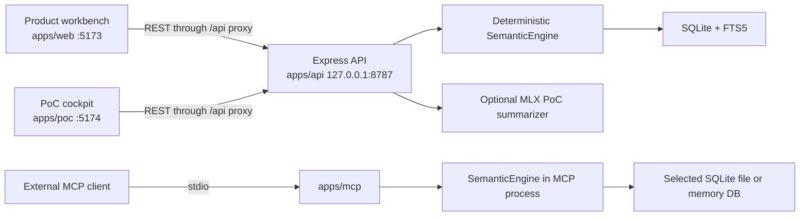
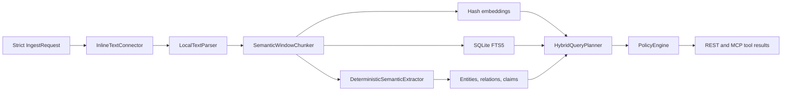
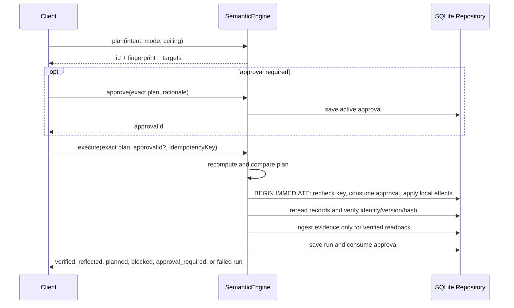

# Architecture

Semantic Junkyard currently implements one local semantic runtime with two HTTP frontends and one MCP stdio entrypoint. The code is organized by capability, but most capabilities are concrete classes created directly by `SemanticEngine`; replaceable production adapters remain a design goal rather than a runtime feature.

## Process Topology

Important boundaries:

- The product and PoC are separate React builds and separate REST clients.
- The PoC cockpit is not an MCP client.
- The MCP server does not call the Express API. It constructs the same engine/repository types in its own process and opens SQLite directly.
- The optional MLX model is reached only by the bundled PoC runner. It is not injected into `SemanticEngine`.

## Product And PoC

The product workbench is the operator surface. It supports ingestion preview and persistence, manual semantic curation, discovery, search, graph inspection, action planning, local approval, execution, and reflected readback.

The PoC cockpit demonstrates how an outside application can consume the REST API. Its conversational flow is still deterministic code: permission check, discovery, search, optional entity and graph grounding, context expansion, planning, execution when autonomous, snapshot refresh, and reflected search. In read-only and plan-only modes it stops earlier. It also stops when a plan is blocked or requires approval because the PoC client has no approval operation.

The PoC's separate audit-run control calls `POST /api/poc/local-agent`. That server-side use case always runs a fixed deterministic tool sequence. Selecting `local-huggingface` adds real MLX generation for the final trace summary only.

## Semantic Pipeline

The implementation is deterministic:

- Source, element, chunk, entity, relation, claim, plan, write, and run IDs use SHA-256-derived stable IDs where the workflow requires stability.
- Chunk summaries are extractive text truncations, not model summaries.
- Entities and relations come from configured local patterns and proper-noun heuristics.
- Embeddings are 128-dimensional signed token hashes.
- Hybrid retrieval combines lexical, vector, graph, quality, freshness, and policy signals without an external reranker.
- Discovery profiles repository counts, terms, entities, relations, and governance signals; it is not an LLM agent loop.

`GET /api/providers` reports whether the selected provider is part of the semantic runtime. Only `deterministic` currently returns `runtimeUsage: "semantic-runtime"`. Ollama and OpenAI-compatible selections return `configuration-only` and are not called.

## Ingestion Modes

All ingestion currently enters through one strict inline request and supports only `text/plain`, `text/markdown`, `text/html`, and `application/json`.

| Mode | Indexed content | Stored `SourceArtifact.text` | Current meaning |
| --- | --- | --- | --- |
| `full_data` | Submitted text | Submitted text | Normal local ingestion. |
| `metadata_only` | Generated note containing name, URI, and metadata | Submitted text | Retrieval behaves as metadata-only, but storage does not. |
| `external_reference` | Generated note containing name, URI, and metadata | Submitted text | Registers a reference for retrieval, but storage does not remain external. |

Preview runs the connector, parser, chunker, and extractor without persistence. Ingest repeats that plan, computes vectors, and stores all stages in one SQLite transaction.

The two non-full modes are not a no-copy or data-residency control. A production connector contract must avoid reading or persisting payloads when the selected mode forbids it.

## SQLite Read Model

SQLite stores:

- Sources, parsed elements, chunks, FTS rows, and vectors.
- Entities, entity/evidence links, relations, and claims.
- Catalog assets, metrics, policies, lineage, ontology classes, and semantic contract headers.
- Discovery runs and events.
- Simulated source-system records with monotonically increasing versions.
- Business action runs, approvals, and audit events.

The graph is represented by relational tables and assembled as snapshots. Vectors are JSON arrays and are scored in process. There is no separate graph, vector, object, queue, or policy service.

The default API database path is `data/semantic-junkyard.sqlite`, resolved from the API process working directory. Root npm workspace scripts run the API in `apps/api`, producing `apps/api/data/semantic-junkyard.sqlite`. MCP independently resolves that product database relative to its installed module location, not the spawning client's working directory, unless `--db`, `--memory`, or `SEMANTIC_JUNKYARD_DB` overrides it.

## Action Planning

The business-action router is deterministic and currently demo-specific:

1. Run a policy-filtered hybrid search for up to four evidence results.
2. Classify the intent with regular expressions as metric alignment, traceability publication, owner review, operational semantic update, unsupported, or blocked.
3. Resolve a metric and asset pair from the local catalog.
4. Evaluate the resolved assets with the fixed confidential-clearance automation actor; deny blocks the plan, while stale or low-quality review decisions gate every target for approval.
5. Construct local targets for configured source-system capabilities.
6. Combine target risk with the request's autonomy ceiling and the server ceiling.
7. Block destructive/privileged patterns, unsupported intents, denied assets, and evidence-free plans.

Source-system capability declarations come from validated built-in defaults or the optional JSON path in `SEMANTIC_JUNKYARD_SOURCE_SYSTEMS_FILE`. The router still emits fixed target IDs and operations, so arbitrary systems in that file do not create new routes or connector implementations. The recognized targets are local simulations:

- Data Catalog updates local metric or asset rows and a source record.
- OpenMetadata Mirror updates local lineage and a source record.
- dbt Semantic Repository writes only a pull-request-shaped source record.
- Governance Ticketing writes only an owner-review-shaped source record.

No external catalog, metadata API, Git provider, or ticketing API is called.

## Plan Identity And Fingerprint

Planning returns two identifiers:

- `id`: `action_plan_` plus the first 16 hex characters of SHA-256 over the intent, resolved action type, and target object keys.
- `fingerprint`: the full lowercase SHA-256 of JSON containing `id`, `intent`, `actionType`, `mode`, `maxAutonomousRisk`, resolved `risk`, complete `targets`, and `warnings`.

The timestamp is deliberately outside the fingerprint, so an unchanged deterministic plan can be approved and executed even though each recomputation has a new `createdAt`.

Approval and execution rebuild the plan from the submitted intent, mode, maximum risk, and context, then compare both values. A mismatch returns `PLAN_CHANGED`. The accepted `context` object is currently ignored by routing and therefore does not affect either identifier.

Plans are not stored in a plan table. The reviewed response must be retained by the client until approval or execution.

## Approval And Idempotency

An approval can be created only when the recomputed plan status is `approval_required`. The approval record contains the exact plan ID and fingerprint, approver identity, rationale, state, and timestamps. It begins `active`, is accepted only for that exact plan, and becomes `consumed` after an executing transaction. There is no expiration or revocation API.

In authenticated HTTP mode, only the distinct approval bearer token has the approver role. With no API token configured, local HTTP requests receive the development-only local approver role. MCP has no approval tool; an approval must be created through the HTTP product channel and passed to MCP execution if both processes share the same database.

Execution requires a globally unique idempotency key:

- The run ID is stable from that key.
- A saved terminal run is returned without a second write only when plan ID, fingerprint, intent, mode, and autonomy ceiling match the original request.
- A saved `approval_required` run may be replaced using the same key after approval.
- Reusing a key for an incompatible request returns `IDEMPOTENCY_CONFLICT`.

Execution enters a SQLite `BEGIN IMMEDIATE` transaction, rechecks idempotency after obtaining the write lock, and conditionally consumes an exact active approval before applying source effects. Approval consumption and writes commit together; rollback leaves the approval active. File-backed databases use a five-second busy timeout so concurrent processes wait briefly instead of racing the approval check.

## Execution And Reflection

Reflection reconstructs an expected record from plan fingerprint, step, system, object, operation, and diff. It verifies that hash plus source-record ID, version, write ID, intent, and plan ID. Verified writes are rendered into a reflection document, ingested as new evidence, and linked to source-system entities with `REFLECTED_IN` relations.

Every write target must verify for the run to be `verified`. If the transaction succeeds but readback is missing or drifted, the run is `reflected`; only individually verified writes can contribute semantic evidence. If execution throws, the write transaction rolls back and a separate `failed` run is saved without writes or semantic updates.

## HTTP Boundary

Express applies request IDs, Helmet, a CORS allowlist, optional bearer authentication, JSON body limits, strict schema validation, structured errors, and request audit events. The default host is loopback. Non-loopback startup requires an API token, and configuring that token also requires a different approval token.

The browser applications normally use same-origin `/api` calls through Vite proxies. `VITE_API_URL` can bypass the proxy, but the browser clients do not add bearer credentials themselves. A secured deployment therefore needs a reverse proxy or backend-for-frontend that supplies credentials without exposing them to browser code.

## MCP Boundary

The MCP server exposes ten tools, six resource descriptors (including the evidence template), and three prompts over stdio. Pure read tools are annotated read-only and idempotent. `run_discovery` is non-destructive but non-idempotent because it persists a fresh run and events. Catalog and graph resources are capped snapshots with total counts and truncation metadata; bounded traversal tools are the navigation path. `business_action_execute` is annotated mutating, non-destructive, and idempotent.

The REST routes `/api/mcp/tools` and `/api/mcp/capabilities` are metadata snapshots only. They are not an MCP transport endpoint.

Because MCP opens the database directly, HTTP CORS, bearer roles, body limits, and request middleware do not apply. Process and filesystem isolation are required for production use.

## Extension Boundary

The module catalog returned by status describes intended interchangeable capabilities, but it is descriptive configuration. The source-system capability catalog is separately configurable through validated JSON. `SemanticEngine` still instantiates the inline connector, local parser, chunker, deterministic extractor, hash embeddings, query planner, policy engine, discovery agent, and local write/reflection logic directly.

The next architectural step for a real provider or connector is to introduce typed interfaces and a configuration-driven composition root, then inject implementations into the engine. Environment-variable branches that only change labels do not satisfy that boundary. See [Adapter contracts](adapter-contracts.md).
