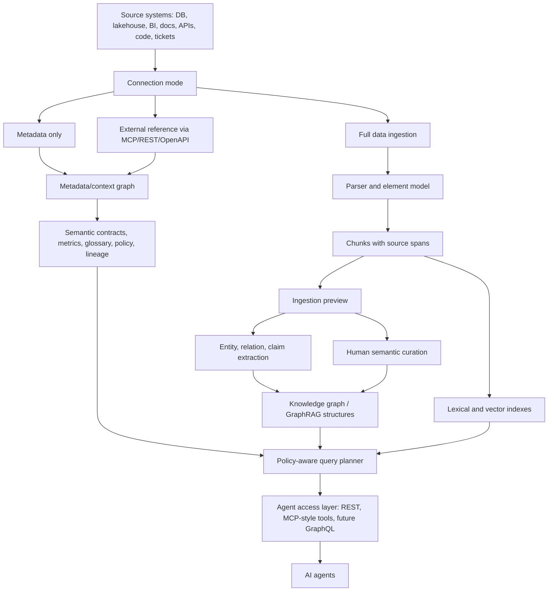

# Architecture

Semantic Junkyard is a modular semantic control plane for AI agents. It does not try to replace data catalogs, vector stores, graph databases, metric layers, policy engines, or document parsers. It defines the contracts that let those systems work together as one governed, agent-readable context layer.

## Layer Model

## Connection Modes

Semantic Junkyard supports three ingestion modes because not every source should be copied into the semantic layer.

| Mode | Use when | Stored locally | Agent capability |
| --- | --- | --- | --- |
| Full data | Documents, knowledge bases, safe extracts, local corpora | Source text, chunks, vectors, graph evidence | Search, traverse, cite evidence |
| Metadata only | Databases, BI, pipelines, governed assets | Asset metadata, schema, owner, lineage, contracts, policies | Discover and recommend authorized assets |
| External reference | Systems that must remain external | URI, metadata, tool descriptor, policy boundary | Ask via external MCP/REST/OpenAPI adapter |

This distinction is central to governance. An autonomous agent may discover that a system exists without being authorized to read the full payload.

## Controlled Semantic Creation

Semantic Junkyard separates automatic discovery from authoritative semantics.

| Layer | Owner | Purpose |
| --- | --- | --- |
| Ingestion preview | System + human reviewer | Show proposed chunks, entities, relations, claims, and warnings before persistence. |
| Discovered semantics | Extractors and discovery agents | Candidate graph edges and claims inferred from evidence. |
| Curated semantics | Human/domain owner | Authoritative relationships such as `DEPENDS_ON`, `WRITES`, `GOVERNS`, or domain-specific relation types. |
| Catalog semantics | Data/product owner | Governed assets, metric contracts, policies, lineage, and ontology classes. |

Manual curation creates evidence-backed graph assertions rather than opaque edges. If a reviewer adds `Billing Pipeline DEPENDS_ON Revenue Mart`, the system stores a curation evidence chunk, links both entities to it, and adds a typed relation to the graph. This keeps human decisions auditable and available to agents.

## Core Domain Objects

- `SourceArtifact`: immutable raw or referenced source record.
- `DocumentElement`: parser output with source offsets.
- `Chunk`: retrieval unit with provenance and summary.
- `Entity`: canonical concept with aliases, confidence, and evidence.
- `Relation`: typed graph edge with confidence and evidence.
- `Claim`: atomic assertion linked to source evidence.
- `SemanticAsset`: dataset, table, dashboard, API, document, semantic contract, metric, or glossary term.
- `MetricDefinition`: governed metric expression, dimensions, owner, and contract version.
- `PolicyRule`: allow, mask, deny, or review rule.
- `LineageEdge`: asset dependency using OpenLineage-style semantics.
- `OntologyClass`: pragmatic ontology class and constraints.
- `SemanticContract`: versioned domain package for distributed semantic layers.

## Agent Autonomy Boundary

Agents can autonomously:

- Search authorized semantic context.
- Traverse bounded graph neighborhoods.
- Resolve entities and inspect evidence.
- Expand context packs for answers.
- Explain what they are allowed to do.
- Flag stale, low-quality, restricted, or contradictory assets.

Agents cannot autonomously:

- Mutate source systems.
- Execute generated SQL against production data.
- Send external communications.
- Delete data.
- Bypass policy, masking, lineage, or quality checks.
- Expose secrets or restricted data.

Those actions require separate approval-gated adapters.

## Capability-Agnostic Design

Every major capability is replaceable.

| Capability | Local implementation | External adapters |
| --- | --- | --- |
| Model/extraction | Deterministic rules | Ollama, OpenAI-compatible, Anthropic-compatible, local LLMs |
| Parser | Local text/Markdown/HTML | Docling, Apache Tika, Unstructured |
| Metadata store | SQLite | PostgreSQL, DataHub, OpenMetadata, Apache Atlas |
| Vector store | SQLite vector rows | Qdrant, pgvector, Milvus, Weaviate, LanceDB |
| Graph store | SQLite graph tables | Neo4j, Kuzu, Memgraph, Apache AGE, RDF/SPARQL |
| Metric layer | Local contracts | dbt MetricFlow, Cube, OSI import/export |
| Lineage | Local lineage edges | OpenLineage, Marquez, DataHub, OpenMetadata |
| Policy | Local ABAC rules | OPA, Apache Ranger, OpenFGA, custom PDP |
| Ontology validation | JSON constraints | SHACL, OWL, RDFS, Apache Jena |
| Agent protocol | REST + MCP stdio server | GraphQL, SDKs |
| Observability | SQLite audit/events | OpenTelemetry, Langfuse, Phoenix, SIEM |

## Why Vector Search Alone Is Not Enough

Vector search can find semantically similar text, but agents also need:

- Which data asset is authoritative.
- What metric definition is governed.
- Who owns an asset.
- Whether the asset is stale, sensitive, or low quality.
- Which lineage path produced a table.
- Which relation or claim is supported by evidence.
- What actions are allowed for the current actor.
- How to stop safely when evidence is insufficient.

Semantic Junkyard combines vector retrieval with metadata graph, knowledge graph, ontology constraints, lineage, policy, metric contracts, and evidence spans.
