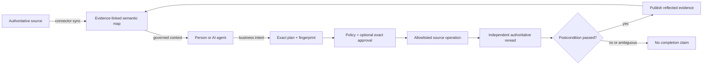
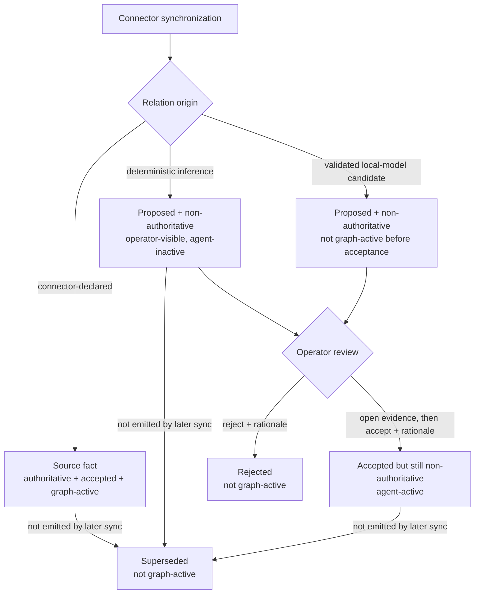
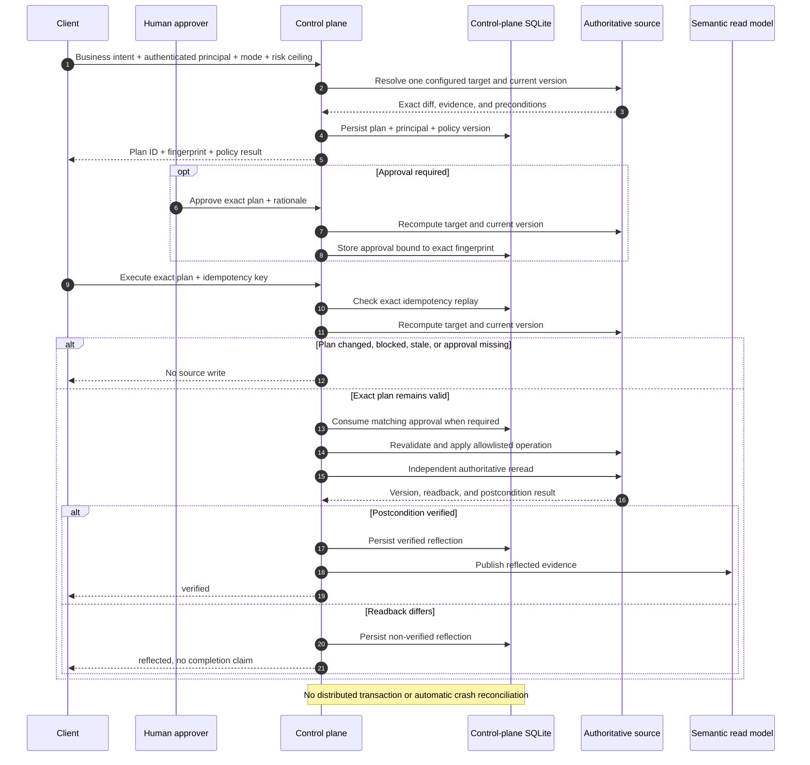

# How Semantic Junkyard Works

Semantic Junkyard gives people and AI agents one governed way to understand existing data and request controlled changes to the systems that own it.

The key design choice is simple: Semantic Junkyard owns the derived map and audit trail; connected systems continue to own their data.

## 1. The Core Contract

The read path answers: **What source-linked evidence and relationships may this agent use?**

The write path answers: **What exact source change is allowed, and can the system prove the resulting source state?**

## 2. What Is Authoritative

| Artifact | Meaning | Authority |
| --- | --- | --- |
| Filesystem/Git content and SQLite schema/rows | Data owned by a connected system. | Authoritative source |
| Observed resource | A discovered file, table, column, metric, contract, or similar object. | Derived observation with source identity |
| Evidence chunk | A bounded text span linked to its source and resource. | Derived evidence; source remains authoritative |
| Source fact | A connector-declared fact, such as a foreign key. | Authoritative observation, accepted automatically |
| Semantic proposal | A connector inference or validated model candidate. | Non-authoritative, even after acceptance |
| Semantic read model | Search, graph, catalog, evidence, proposals, and audit records. | Derived control-plane state |
| Business action plan | Exact target, diff, preconditions, risk, and fingerprint. | Read-only candidate change |
| Approval | Human decision bound to one plan ID and fingerprint. | Human control-plane decision |
| Reflection | Authoritative reread and explicit postcondition result. | Required completion evidence |

The control-plane SQLite database stores the derived read model, source connection configuration, sync runs, proposals, decisions, plans, approvals, action runs, reflections, and audit events. It never replaces a connected source as the system of record.

## 3. Processes And Security Boundaries

The [project README](../README.md#understand-it-in-one-minute) shows the process map. The important boundaries are:

- `apps/web` is the operator workbench and calls the REST API.
- `apps/poc` is a separate external REST client with no shared frontend state or hidden product privilege.
- `apps/mcp` is a separate process. It opens the selected control-plane database and configured local source paths directly; it does not proxy the REST API.
- REST tokens and CORS do not constrain MCP. MCP startup flags and operating-system permissions are the effective boundary.
- The optional local model receives bounded prompts and returns typed candidates. It is not a policy engine, approver, connector, or postcondition evaluator.

An MCP server described as read-only has no source mutation tools by default. It can still write local audit records and apply control-plane database migrations during startup; “read-only” refers to exposed agent capabilities, not a byte-for-byte read-only process.

## 4. How Source Synchronization Works

Connection creation, testing, and synchronization are separate operations:

1. **Create** validates the typed configuration and stores the connection. It does not test external access.
2. **Test** explicitly checks that the configured connector can access a valid source.
3. **Synchronize** tests again, acquires a per-connection SQLite lease, then asks the connector for one bounded discovery snapshot.
4. The source manager transactionally replaces observations owned by that connection, materializes evidence, parses, chunks, indexes, and extracts semantic material.
5. Connector-declared facts are accepted as source facts; connector inferences become proposals.
6. Optional local Hugging Face enrichment receives at most the configured bounded resource summaries. Invalid or invented IDs are discarded.
7. Assertions no longer emitted by a later sync become `superseded`.

Every synchronization records inspectable events, counts, warnings, provider identity, checkpoint, and completion state. The dashboard can run one source-wide discovery mission that orchestrates configured connections and persists an aggregate report. Synchronization runs in process; there is no durable queue or resume worker.

### Implemented connectors

| Connector | Discovers | Source write capability |
| --- | --- | --- |
| Filesystem | Supported text/PDF content, structured files, contracts, lineage-shaped data, and metadata within configured limits. | None. Filesystem is read-only. |
| SQLite | Schema, tables, columns, keys, foreign keys, row counts, bounded samples, sensitivity signals, and evidence. | One resolved row and only configured columns/keys. |
| Git | Supported committed blobs at `HEAD`, paths, versions, YAML contracts, and provenance. | Only configured semantic-contract paths. |

Source-local catalog IDs are namespaced by connection before publication. This prevents equal IDs from different sources from overwriting one another while retaining the original declared ID as provenance.

The persistent reference bootstrap retries connections that are `configured`, `syncing`, `error`, missing a last synchronization, or missing published resources. A `degraded` connection with published resources is not automatically retried by the current bootstrap rule.

## 5. How Semantic Meaning Is Governed

Not every relation follows the same lifecycle:

The practical rules are:

- A source fact cannot be rejected in the semantic layer. Change the source or its authority mapping.
- Accepting a deterministic/model proposal confirms it for navigation; it does **not** make it authoritative.
- Pending connector and local-model relations are visible to operators but excluded from non-operator graph traversal and graph-based retrieval boosts.
- Accepted non-authoritative relations enter agent navigation while remaining visibly distinct from authoritative source facts.
- Rejected and superseded relations are excluded from graph traversal and retrieval boosts.
- Changed evidence, confidence, or explanation creates a new non-authoritative proposal identity. An older decision is not silently reused.

Direct `POST /api/ingest` extraction and manual `POST /api/semantic/relations` curation currently persist derived relations immediately and do not create `SemanticProposal` records. Direct-ingest relations are marked proposed and excluded from agent graph reasoning. Manual curation requires evidence plus a rationale and creates an accepted, non-authoritative relation. The first-class proposal queue above applies to connector synchronization and local-model enrichment. This is a reference limitation, not a universal governance guarantee.

## 6. How An Agent Reads And Discovers

The intended evidence-first procedure is:

1. Ask `explain_permissions` for capability and stop conditions.
2. Use `source_resource_search` to find observed files, tables, columns, metrics, and contracts.
3. Use `semantic_search` with domain scope for policy-filtered lexical/vector/graph-ranked business evidence. Operational write receipts are a separate explicit scope.
4. Resolve canonical entities, then traverse bounded graph neighborhoods or paths.
5. Use `expand_context` with the same evidence scope, then open individual evidence chunks before answering or planning.
6. Answer with source-linked evidence, or stop if the bounded context is insufficient.

`run_discovery` is an objective-aware profile of the **already persisted semantic fabric**. It records a discovery timeline but does not connect to or synchronize source systems. `POST /api/discovery/missions` and MCP `discover_sources` orchestrate actual source synchronization before profiling the resulting fabric.

The conversational PoC makes this procedure visible as REST requests, typed artifacts, observations, evidence, policy decisions, stop reasons, action plans, source readbacks, and refreshed evidence. It does not request or expose hidden chain-of-thought.

## 7. How A Business Intent Becomes A Source Change

The client sends business intent, never arbitrary SQL, shell commands, paths, or patches.

Planning is source-read-only but persists its review artifact. The fingerprint covers the normalized principal, policy version, intent, action type, mode, risk ceiling, resolved risk, complete target, preconditions, diff, and warnings. Approval and execution require that persisted plan and recompute it; any material change invalidates the old identity, and a different execution principal must create a new plan.

If an exception occurs after an approval has been reserved, the run becomes `reconciliation_required`, the approval remains consumed, and the idempotency key cannot authorize a blind retry. A process crash after a source commit but before control-plane persistence remains an untracked failure window.

### Autonomy is a ceiling

| Request mode | Behavior |
| --- | --- |
| `dry_run` | Persist a non-executing plan/run; no source operation. |
| `approval_required` | Force human approval even if the configured capability could otherwise be autonomous. |
| `autonomous` | Execute only when the target permits autonomy and risk is within both caller and server ceilings. |

Zero or multiple valid targets, missing evidence, denied resources, destructive intent, stale source state, an unallowlisted field/path, or a changed fingerprint all fail closed.

## 8. Do Not Mix Artifact Statuses

The shared schema contains a broad status union, but the current engine uses different subsets for different artifacts:

| Artifact | Current statuses with operational meaning |
| --- | --- |
| Plan | `planned`, `approval_required`, `blocked` |
| Non-executing run | `planned` for dry run, `approval_required`, or `blocked` |
| Executed run | `verified`, `reflected`, or `reconciliation_required` |
| Individual source write | `executed`, `skipped`, or `failed` |
| Individual reflection | `verified`, `missing`, or `drift` |

`executed` is not a completion claim. Only a run with verified authoritative readback may report completion and publish reflected semantic evidence.

For SQLite, the precondition is a hash of the current source row and readback uses a new read-only connection. For Git, preconditions include `HEAD` and blob identity; readback inspects committed `commit:path` content. An already-satisfied no-op records a `skipped` source write and still performs readback.

## 9. What The Optional AI Model Does

| Role | Output | Effect |
| --- | --- | --- |
| Source enrichment | Bounded concepts, classifications, relations, and conflicts. | Valid candidates become non-authoritative proposals. |
| Intent interpretation | Typed objective, queries, action candidate, confidence, and warnings. | Input to deterministic grounding and planning only. |
| PoC trace summary | Two IDs selected from verified audit facts. | Deterministic renderer produces human-readable narration. |

The model cannot create approvals, decide authority, generate arbitrary source operations, bypass policy/configuration, evaluate postconditions, or mark a run complete. Malformed intent output stops the request; malformed/invented enrichment candidates are discarded. Model compatibility is checked only when the local MLX process starts.

## 10. Which Surface To Use

| Surface | Use it for | Boundary |
| --- | --- | --- |
| Product workbench, port `5173` | Configure/sync sources, review semantics, inspect evidence/graph, plan, approve, execute, and audit. | Tokenless loopback grants a local owner role. Authenticated deployments require separate operator and approver roles. |
| Conversational PoC, port `5174` | Observe an external REST client discover, narrate, stop, plan, execute autonomous actions, and reread evidence. | Cannot approve itself. |
| REST API, port `8787` | Build external products and agent clients against strict contracts. | Separate agent, operator, and approver bearer tokens when authentication is enabled. |
| MCP stdio server | Give an MCP agent bounded search, graph, evidence, planning, and optional mutation tools. | Source mutations are disabled by default and require explicit startup flags; no approval-creation tool. |

The current browser clients do not attach bearer tokens themselves. A non-loopback authenticated deployment therefore needs an auth-injecting proxy or a client change; the supplied UI is a local reference interface, not a production IAM client.

## 11. What Is Demonstrated And What Is Not

The repository demonstrates and tests the listed local workflows with real files, a real operational SQLite source, and a real Git worktree. Tests cover contracts, connectors, plan identity, approvals, local idempotency, readback, semantic refresh, MCP capability boundaries, and browser workflows.

It does not provide production IAM, tenant isolation, source ACL propagation, remote enterprise connectors, a durable workflow engine, automatic reconciliation, distributed exactly-once semantics, clustering, high availability, or backup orchestration.

Continue with the [Hands-on guide](user-guide.md), inspect the deeper [Architecture](architecture.md), or return to the [documentation index](README.md).
