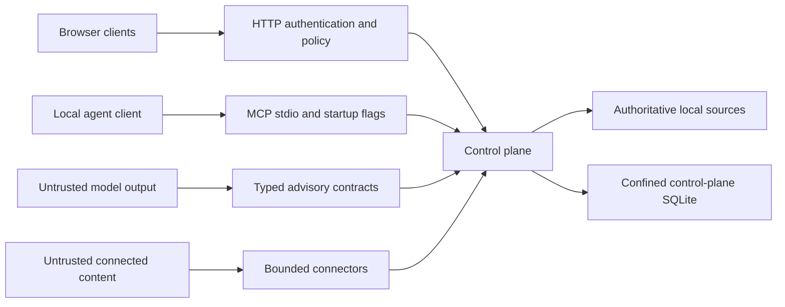

# Threat Model

This threat model covers the `v0.1.0-alpha.1` local reference release. It explains what the shipped
controls protect, what authority a caller or process still retains, and which risks remain for a
production deployment. It should be read with the [architecture](architecture.md) and
[security policy](../SECURITY.md).

## Scope And Security Goals

The protected system is one Semantic Junkyard process group: the HTTP API, the MCP stdio server,
the single-node control-plane SQLite database, configured local connectors, the two browser
applications, and the optional local-model subprocess.

The release has five security goals:

1. Untrusted content cannot grant tools, change connector configuration, approve a plan, or declare
   a source write successful.
2. Every write resolves to one configured capability, exact target, expected source version, actor,
   policy version, and postcondition.
3. The semantic read model cannot replace an authoritative source or turn an inference into a source
   fact.
4. Agent-facing reads do not disclose operational paths or data denied by the local policy engine.
5. A control-plane database remains inside the product-owned root used by the default launchers or
   an explicit root supplied by a programmatic embedding host.

These are local application guarantees. They are not claims of tenant isolation, distributed
exactly-once execution, operating-system sandboxing, or protection after host compromise.

## Assets

| Asset | Why it matters | Primary protection |
| --- | --- | --- |
| Authoritative source state | It contains the business record an agent may request to change. | Allowlisted connector operations, source-version preconditions, and authoritative readback. |
| Control-plane database | It stores evidence, plans, approvals, runs, and audit events. | Deterministic product root, relative path policy, symlink rejection, and private modes where supported. |
| Evidence and provenance | They justify an answer or action. | Stable source identity, version binding, policy filtering, and lifecycle separation. |
| Actor and approval context | It determines who may plan, approve, or execute. | Distinct credentials, exact plan fingerprints, principal binding, and role checks. |
| Connector configuration | It defines the sources and operations available to the process. | Trusted startup/operator boundary and typed, bounded connector contracts. |
| Local model input and output | It may contain governed context or adversarial text. | Bounded typed outputs, time and output limits, and no authority over policy or postconditions. |

## Actors And Assumptions

| Actor | Assumed authority |
| --- | --- |
| Local operator | May start the process, select a relative database name, configure connectors, and protect local files. A default launcher cannot redirect the database root through environment or command-line input. This is still a privileged role. |
| HTTP agent | May use only the routes permitted by its credential and the policy decision for its actor context. |
| Human approver | May approve the exact persisted plan presented through a separate credential path. |
| MCP client | Has the operating-system authority of the process that starts the stdio server. Startup flags define which tool groups exist. |
| Source contributor | May supply malformed, misleading, sensitive, or instruction-like content but has no configuration authority. |
| Local model | Is untrusted advisory computation. Its output may be malformed or deceptive. |

The host, Node.js runtime, installed dependencies, and account running the processes are trusted.
A hostile local administrator or compromised dependency can read process memory and files and is
outside the protection offered by this application.

## Trust Boundaries

| Boundary | Input considered untrusted | Enforced control | Residual risk |
| --- | --- | --- | --- |
| HTTP | Bodies, headers, actor labels, origins | Strict schemas, body limits, role middleware, CORS, policy, exact-plan execution | Tokenless loopback mode is deliberately a development profile; CORS is not authentication. |
| MCP stdio | Tool arguments and client behavior | Read-only default registration, strict tool schemas, independent mutation flags | A trusted launcher can grant broad filesystem authority or mutation tools. REST credentials do not apply. |
| Source ingestion | Files, HTML, PDFs, rows, Git content | Parser limits, symlink rejection for filesystem ingestion, bounded extraction, provenance, policy filtering | Reference parsers are not sandboxed and may still contain unknown dependency defects. |
| Model adapter | Generated text and typed candidates | Output-size and time bounds, schema validation, known-resource checks, advisory-only semantics | Optional runtime packages and model code execute with host-user authority. |
| Connector write | Intent, target, source version, exact diff | Compiled allowlist, plan fingerprint, approval where required, idempotency, native transaction or commit, reread | Control-plane and source writes are not one distributed transaction. |
| Storage startup | Relative database name; explicit root only for a programmatic host | Fixed product root in default launchers, relative portable path, containment checks, link and recognized rollback/WAL sidecar rejection, private modes | A custom embedding host selecting another root is trusted; same-account concurrent filesystem replacement is outside the alpha guarantee. |

## Security Invariants

The alpha release is expected to fail closed when any of these invariants is false:

- A caller cannot add unknown fields such as a self-declared approval to a business-action request.
- Approval is bound to one persisted plan ID and fingerprint; execution recomputes both.
- Actor, normalized roles, clearance, and policy version are part of plan identity.
- An idempotency key cannot be reused for a different request identity.
- Connector execution cannot target a table, column, row, or contract path outside configured rules.
- A successful connector response is insufficient: the source must be reread and the expected
  postcondition must match.
- Failed or ambiguous readback does not publish fresh semantic reflection evidence.
- Model output cannot approve, bypass policy, create arbitrary source operations, or certify a
  postcondition.
- Pending, rejected, and superseded semantic assertions are excluded from active agent reasoning.
- A file-backed control-plane database uses a relative path confined to its authorized root; default
  launchers expose no environment or command-line root override. Absolute, drive-qualified,
  traversal, file-URI, reserved-device, symbolic-link, multiply linked, and recognized orphaned
  rollback/WAL sidecar layouts are rejected.

## Threat Scenarios And Current Mitigations

| Scenario | Expected behavior | Verification evidence |
| --- | --- | --- |
| A request embeds an approval flag or extra operation | Schema validation rejects unknown fields. | API integration and shared-contract tests. |
| A different principal executes a saved plan | Execution returns a principal mismatch and requires a new plan. | Semantic engine and API integration tests. |
| Source state changes after planning | Fingerprint or connector precondition fails; no stale overwrite is claimed. | SQLite and Git connector tests. |
| A retry reuses a key for another action | The request is rejected as an idempotency conflict. | Semantic engine tests. |
| A connector reports success but readback differs | The run is not verified and no fresh reflection is published. | Source workflow integration tests. |
| A process observes an ambiguous source result | The run requires reconciliation and consumed approval cannot be silently reused. | Source workflow integration tests. |
| HTML is excessively large or deeply nested | Parsing fails at configured input, tree-depth, or child-node limits and the API remains healthy. | API integration and text-boundary tests. |
| Connected text contains tool instructions | The text remains evidence data and receives no policy or tool authority. | Typed pipeline design plus agent-contract tests. |
| An agent requests a denied or sensitive resource | Actor policy filters or masks the returned content and operational paths. | API, MCP, and policy tests. |
| Startup supplies traversal or a symlink for the control database | Storage preparation rejects the layout before opening SQLite; the default launcher cannot be redirected to another root. | Database path-policy and default-root tests on portable path forms and filesystem links. |
| Startup finds an orphan sidecar or multiply linked database artifact | Storage preparation fails before creating or opening the database and leaves the pre-existing artifact unchanged. | Database path-policy regression tests for rollback/WAL artifacts and hard links. |
| Reference bootstrap finds linked or redirected database/Git state | Bootstrap stops before writing fixtures; Git receives an isolated environment, minimal local configuration, literal target path, and a byte-for-byte committed-blob check. | Demo-source tests for hard links, nested metadata links, inherited Git redirects, attributes, excludes, and exact committed bytes. |
| MCP starts without mutation flags | Write execution and persisted discovery tools are absent from capability discovery. | MCP server tests and release smoke. |

## Failure Windows And Residual Risks

The following limitations are accepted for this local alpha and must not be hidden by deployment
language:

- A crash after a source commit but before control-plane persistence may leave a real change without
  a complete run record. There is no reconciliation worker.
- Approval records do not yet expire and there is no delegation, revocation, or recovery workflow.
- Idempotency is local to one SQLite database, not global across nodes or services.
- Static bearer tokens are development controls without rotation, fine-grained scopes, or federation.
- The default tokenless loopback profile gives local callers owner behavior.
- MCP inherits the launching process account and has no tenant or per-tool user identity boundary.
- Local filesystem, SQLite, and Git connectors do not prove the semantics of remote systems.
- The local model runner is not a hermetic sandbox.
- Startup path checks do not prevent a different process running with the same account from replacing
  storage files between checks; the storage directory must be protected from concurrent writers.
- There is no rate limiter, durable queue, high availability, backup orchestration, or source-ACL
  propagation.

## Deployment Requirements Beyond The Alpha

Before exposing the product to multiple users or a network, add identity-aware authentication,
tenant and source-ACL propagation, scoped connector credentials, managed secret rotation, rate and
resource limits, encrypted backup and retention policy, parser/model sandboxing, durable execution
with reconciliation, security telemetry, and an independently reviewed policy decision point.

The release gate runs dependency auditing, type checking, unit and integration tests, a narrow
deterministic benchmark, production builds, browser smoke, and a built-artifact API/MCP smoke on
Linux and Windows. Those checks reduce regression risk; the synthetic benchmark is not a general
quality or safety claim, and the gates do not convert the reference implementation into a production
security boundary.

Report a suspected vulnerability through the private process described in
[Security Policy](../SECURITY.md#reporting).
